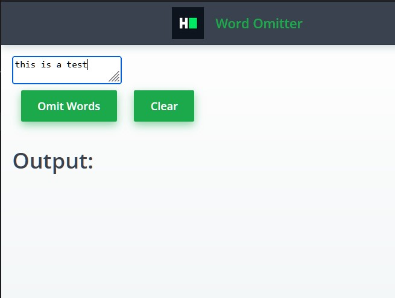

# [HackerRank React WOrd Omitter](https://www.hackerrank.com/challenges/react-word-omitter/problem)
[step1 solution AT](./src/step1.md)
[step2 solution AT](./src/step2.md)
[vercel live version:](https://react-hackerrank-wordomitter.vercel.app/)

You are tasked with creating a simple React application called "Word Omitter" that dynamically filters out specific words from the user input in real-time. The application requirements are detailed below, and the finished application must pass all of the unit tests.

## Detailed Requirements

The WordOmitter component takes an array of words to omit as a prop called omitWords. Each element of this array is a string representing a word that should be filtered out of the user's input.

The application should display a text input field where the user can type a sentence.

As the user types, the output area below the input field should display the sentence with the specified words omitted.

The application should have a toggle button to switch between omitting the specified words and showing all words.

The application should have a clear button that clears both the input field and the output area.
If the input field is empty, the output area should also be empty.

## Sample Interaction

### Initial State

    The input field is empty.
    The output area is empty.
    The button displays "Show All Words" i.e. Omit Mode is enabled

### User Action 1

    User types "This is a test sentence." in the input field.
    The output area displays "This is test sentence." (assuming "a" is omitted).

### User Action 2

    User clicks the toggle button.
    The output area now displays "This is a test sentence." (showing all words).

### User Action 3 
    User clicks the clear button. - Both the input field and the output area are cleared.

